# PET-PC

**A Commodore PET–style desk terminal on an ESP32-C6.** A clock, the weather, your
Home Assistant lights — and two keys that do whatever you tell them to. It boots
into BASIC, loads the weather from tape, and fills the screen with `10 PRINT`
when you leave it alone.

[](https://github.com/Krasnov777/esp32-pet-pc/actions/workflows/build.yml)
[](LICENSE)

**[Project page](https://krasnov777.github.io/esp32-pet-pc/)** · [Quick start](#quick-start) · [Wiring](WIRING.md) · 3D-printable case: coming soon

<p align="center">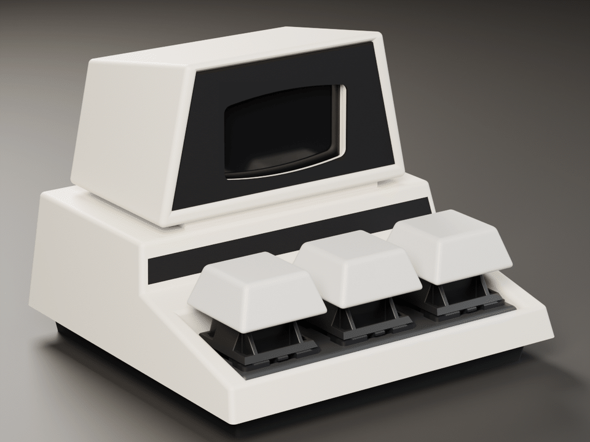</p>

- **Three keys, one OLED.** A 128×64 screen and three mechanical key switches on a
  Waveshare ESP32-C6-Zero. No hub, no cloud, no YAML — the box fetches everything
  itself and is configured from its own web page.
- **Seven screens.** PETSCII block clock, a classic clock, weather, a BASIC
  `READY.` prompt, a live program `LIST`ing, Home Assistant, and system status.
- **Keys you configure.** Each outer key has a press and a hold action: call a
  webhook, jump to a screen, toggle a Home Assistant light, run a scene, cycle a
  selector.
- **Home Assistant, optional.** Show sensors and switch lights from the keys,
  over HA's REST API with a long-lived token — nothing to install on the HA side.
- **Retro all the way down.** BASIC boot banner, a `PRESS PLAY ON TAPE` sequence
  around every weather fetch, CRT wipes and a power-off collapse on the OLED,
  and a web page with scanlines and phosphor glow.
- **Kind to the OLED.** Modest brightness, a night schedule that switches the
  panel off, burn-in pixel shift, and a screensaver.

---

## Screens

The centre key steps through them; pick which ones on the web page.

<p align="center"></p>

<table>
<tr>
<td align="center">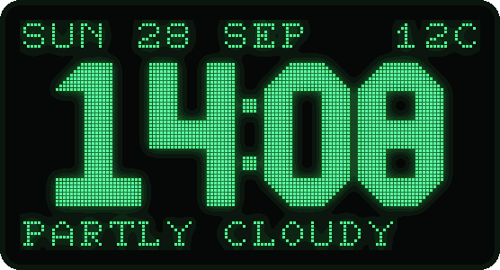<br><b>Block clock</b><br><sub>PETSCII block digits — the default start screen</sub></td>
<td align="center">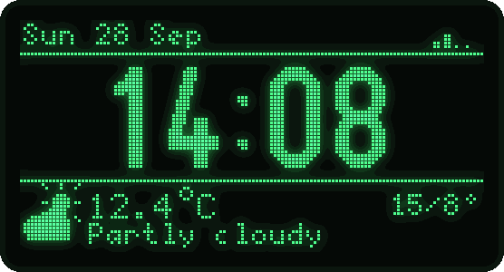<br><b>Clock</b><br><sub>large time, WiFi, weather strip</sub></td>
<td align="center">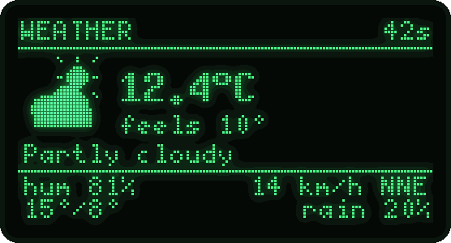<br><b>Weather</b><br><sub>feels-like, humidity, wind, range, rain</sub></td>
</tr>
<tr>
<td align="center">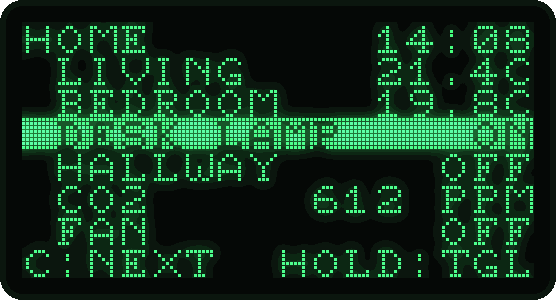<br><b>HOME</b><br><sub>Home Assistant entities; press to pick, hold to toggle</sub></td>
<td align="center">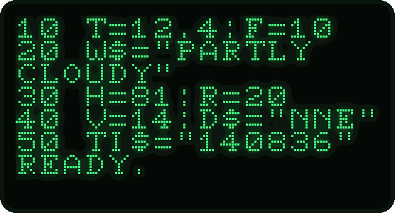<br><b>LIST</b><br><sub>live data as a BASIC program; <code>TI$</code> ticks</sub></td>
<td align="center">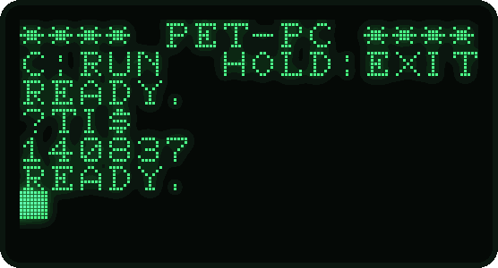<br><b>BASIC</b><br><sub>the centre key types and runs commands</sub></td>
</tr>
<tr>
<td align="center">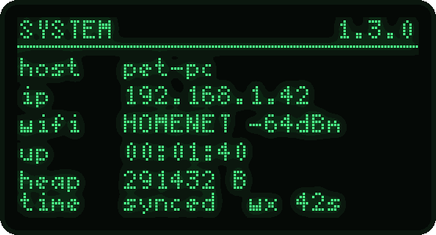<br><b>System</b><br><sub>address, signal, uptime, memory, sync</sub></td>
<td align="center">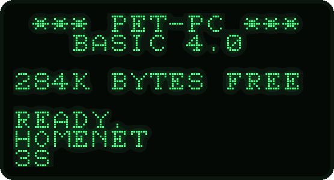<br><b>Boot</b><br><sub>BASIC banner, memory count-up, WiFi</sub></td>
<td align="center">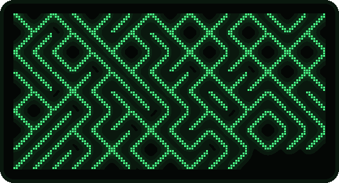<br><b>Screensaver</b><br><sub><code>10 PRINT CHR$(205.5+RND(1));</code></sub></td>
</tr>
</table>

Every weather refresh is loaded from "tape" — then `RUN` prints the reading:

<p align="center">
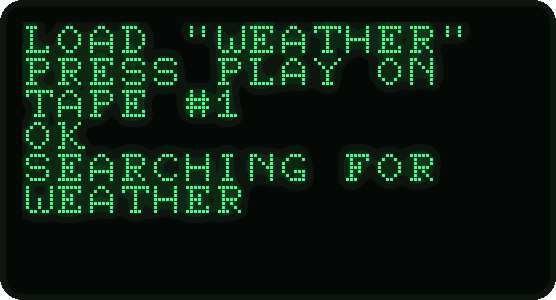
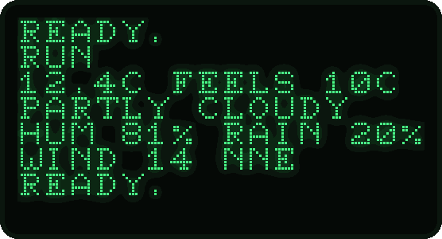
</p>

Screen changes get a scan-line wipe or a vertical-hold roll, and at night the
picture collapses to a line and a dot like a CRT switching off. All of it can be
turned off.

---

## The web page

Everything is set from `http://pet-pc.local/` — no app, no reflashing. The page
is a single file in the firmware, so it also works over the device's own hotspot.

<p align="center">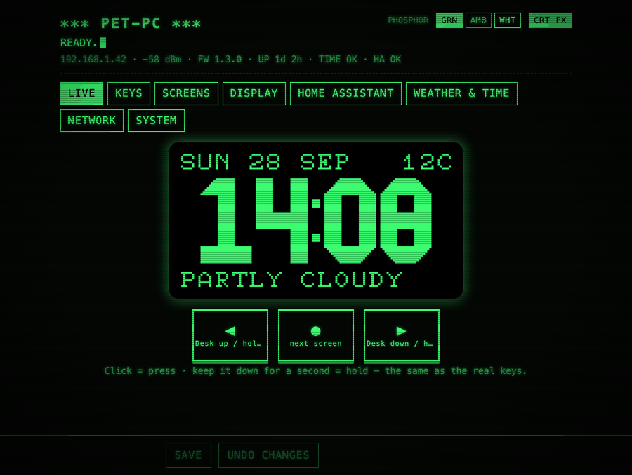</p>

- **Live** — the OLED mirrored in real time, and three virtual keys (click =
  press, keep it down = hold).
- **Keys** — press and hold actions for the outer keys, with **Try it** buttons.
- **Screens**, **Display** — rotation, start screen, screensaver, retro extras,
  brightness, night hours.
- **Home Assistant** — URL, token, **Test connection**, and the HOME entities with
  their live values.
- **Weather & time** — location (or *use this browser's location*), a time-zone
  list, the time server.
- **Network**, **System** — WiFi, device name, status, settings download, restart.

Every setting explains itself. **Save** stays disabled until the settings have
loaded, only what you changed is sent (and marked until saved), bad values are
flagged before sending — `?SYNTAX ERROR` — and changes that would drop the
connection ask first. Green, amber or white phosphor; CRT effects can be
switched off.

<table>
<tr>
<td>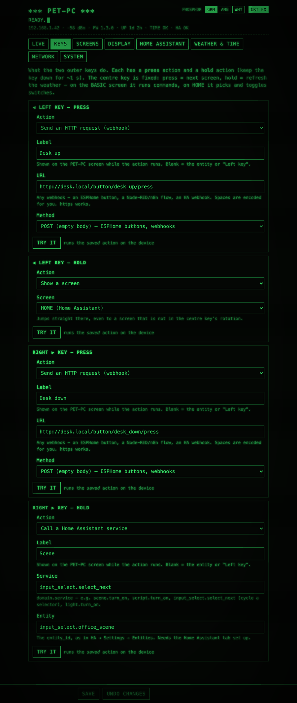</td>
<td>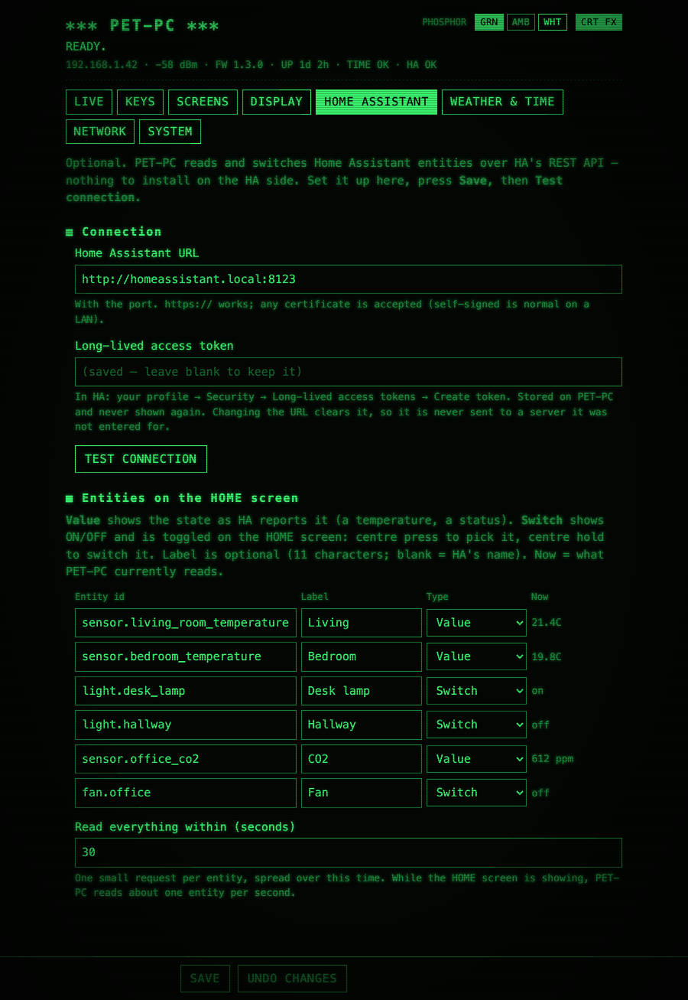</td>
</tr>
<tr>
<td align="center"><sub>Keys: a press and a hold action per key</sub></td>
<td align="center"><sub>Home Assistant: connection and HOME entities with live values</sub></td>
</tr>
<tr>
<td>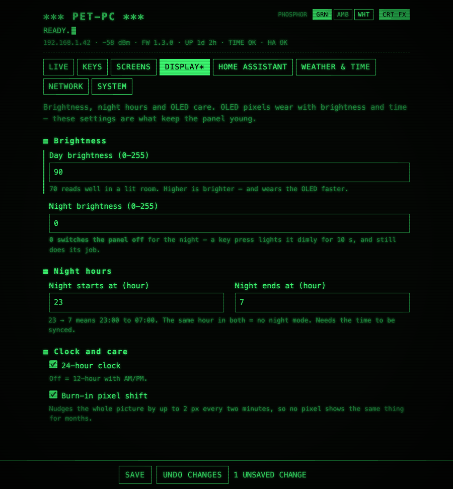</td>
<td align="center">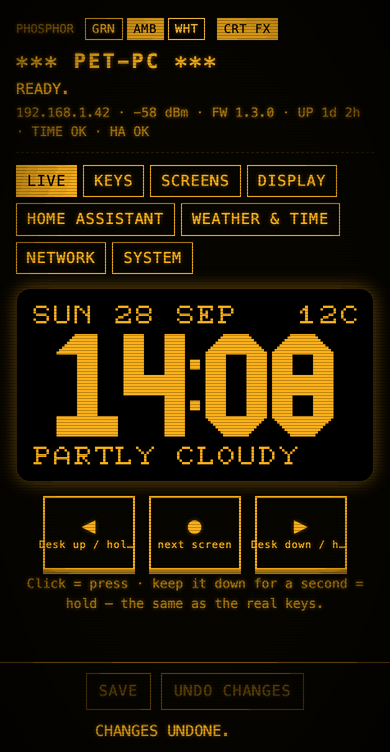&nbsp;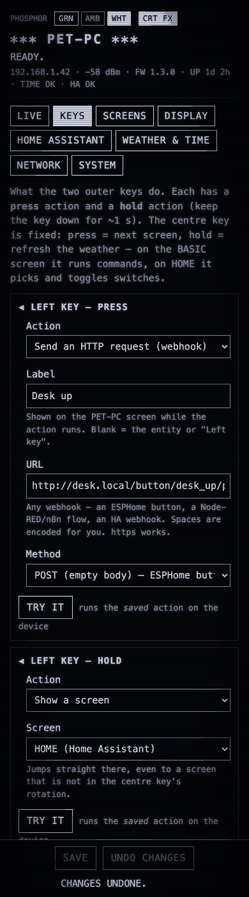</td>
</tr>
<tr>
<td align="center"><sub>An unsaved change: marked field, <code>DISPLAY*</code> tab, Save bar</sub></td>
<td align="center"><sub>On a phone, in amber and white</sub></td>
</tr>
</table>

---

## Hardware

| Part | Notes |
|------|-------|
| [Waveshare ESP32-C6-Zero](https://www.waveshare.com/esp32-c6-zero.htm) | ESP32-C6, 4 MB flash, native USB-C for flashing and serial |
| SSD1306 128×64 I²C OLED (0.96″) | the common 4-pin module, address 0x3C, powered from 3.3 V |
| 3 × MX-style key switches | clicky or tactile suit it best — the switch is the only click there is |
| A PET-style case | 3D-printable models coming soon — or any box with three 14 × 14 mm switch cutouts |

No resistors, diodes or matrix: each switch goes from a GPIO to ground and the
firmware turns on the internal pull-ups. The OLED lands on four consecutive
header pins, so one straight 4-wire ribbon connects it.

| Signal | Pin |
|--------|-----|
| OLED SCL / SDA | GP0 / GP1 (next to GND and 3V3) |
| Left / centre / right key | GP18 / GP19 / GP20 |

Pin map, wiring diagram, the one-GND workaround and assembly tips:
**[WIRING.md](WIRING.md)**. A different pin is a one-line change in
[`board_config.h`](firmware/src/board_config.h).

<p align="center">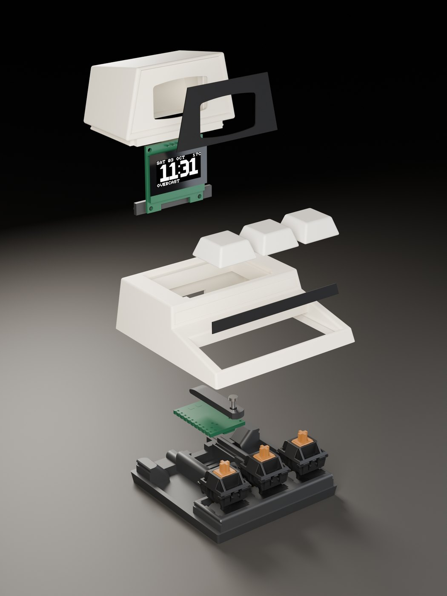<br>
<sub>What's inside: base and switches, the ESP32-C6-Zero under its holder (one M2 screw), the main frame, and the monitor with the OLED.</sub></p>

---

## Quick start

You need [PlatformIO](https://platformio.org/install/cli) **Core 6.2 or newer**
(or the VS Code extension) and a USB-C **data** cable.

```bash
git clone https://github.com/Krasnov777/esp32-pet-pc.git
cd esp32-pet-pc/firmware
pio run -t upload          # first build downloads the toolchain; then flashes over USB-C
pio device monitor         # optional: the boot log, 115200 baud, same cable
```

> If the board does not show up as a serial port: hold **BOOT**, tap **RST**,
> release **BOOT**, and upload again.

**First boot.** With no WiFi configured, PET-PC opens an open hotspot called
**`PET-PC-XXXX`** (the name is on the screen).

1. Join it, browse to **http://192.168.4.1/**, open **Network**, enter your
   WiFi (2.4 GHz), **Save**. PET-PC restarts and joins your network.
2. Browse to **http://pet-pc.local/** (or the IP on the System screen).
3. **Weather & time**: pick your time zone and press *use this browser's
   location* (or type it). **Keys**: set what the outer keys do. Done.

If PET-PC cannot join the network — wrong password, or the router still booting
after a power cut — the hotspot comes back, and while nobody is connected to it
PET-PC retries your network every five minutes.

<details>
<summary>Prefer not to type the WiFi password on a phone? Build it in instead.</summary>

```bash
cp src/secrets.h.example src/secrets.h   # set WIFI_SSID / WIFI_PASSWORD, then build and upload
```

`secrets.h` only seeds the first boot and is git-ignored; after that, settings
live on the device and are edited from the web page.
</details>

### Updating over WiFi

```bash
pio run -e ota -t upload --upload-port <device-ip>
```

The OTA password is `pet-pc` unless you set `OTA_PASSWORD` in `secrets.h` —
**change it** (there and in `upload_flags` in `platformio.ini`) if your network
is shared. Pass the IP rather than `pet-pc.local`: espota's `.local` lookup hangs
on macOS. An upload takes about a minute; settings survive every update.

---

## Keys

| Key | Press | Hold (0.8 s) |
|-----|-------|--------------|
| **Left** | your choice | your choice (default: same as press) |
| **Centre** | next screen · on BASIC: run the next command · on HOME: pick the next switch | refresh the weather · on BASIC: leave · on HOME: toggle the picked switch |
| **Right** | your choice | your choice (default: same as press) |

The centre key is fixed, so the box always navigates the same way. The outer
keys can:

| Action | For example |
|--------|-------------|
| **Send an HTTP request** (POST or GET, http or https) | an ESPHome button (`http://desk.local/button/desk_up/press`), a Node-RED / n8n flow, an HA webhook |
| **Show a screen** | hold left → HOME |
| **Next / previous screen** | the out-of-the-box setting |
| **Refresh the weather** | |
| **Toggle a Home Assistant entity** | `light.desk_lamp` |
| **Call a Home Assistant service** | `scene.turn_on`, `script.turn_on`, `input_select.select_next` (cycle through modes) |

Anything that goes to the network shows "sending…" on the screen, then the
result.

---

## Home Assistant

1. In Home Assistant: your profile → **Security** → **Long-lived access tokens**
   → **Create token**.
2. On PET-PC's page, **Home Assistant** tab: your HA URL with the port (e.g.
   `http://homeassistant.local:8123`; `https://` works too), the token, and up to
   six entities. **Save**, then **Test connection**.
3. HOME joins the centre key's screens.

Each entity is a **Value** — shown as HA reports it, with its unit (`21.4C`,
`612 ppm`) — or a **Switch** — `ON`/`OFF`, picked with a centre press and
toggled with a centre hold. The type is suggested from the entity's domain
(`light.`, `switch.`, `fan.`, `input_boolean.`, `automation.`, `cover.` are
switches); change it to watch a light without being able to toggle it.

PET-PC reads one entity at a time, so each request is small; a full round takes
30 s by default, about one entity a second while HOME is on screen. If HA is
down or refuses the token, the screen says so and PET-PC backs off for a minute.

The token is **write-only**: the page never shows it again, a blank field keeps
it, and changing the URL clears it — so it is never sent to a server it was not
entered for.

---

## API

The page uses a small JSON API, open to your own scripts too:

| Method | Path | |
|--------|------|-|
| `GET`  | `/api/state` | settings and live status (the WiFi password and HA token are never included) |
| `POST` | `/api/settings` | a JSON patch in the same shape — only the keys you send change |
| `POST` | `/api/key?key=left\|center\|right&hold=0\|1` | press or hold a key |
| `POST` | `/api/mode` | next screen |
| `POST` | `/api/ha/test` | test the saved Home Assistant connection |
| `POST` | `/api/reboot` | restart |
| `GET`  | `/shot.bmp` | the current screen as a 1-bit BMP |

```bash
curl -X POST 'http://pet-pc.local/api/key?key=right'          # press the right key
curl -X POST -H 'Content-Type: application/json' \
     -d '{"display":{"contrast_day":90}}' http://pet-pc.local/api/settings
```

---

## Good to know

- **The web page and API have no password.** Anyone on your network can change
  settings or press the keys; the WiFi password and HA token cannot be read
  back. Keep PET-PC on a network you trust.
- **Change the OTA password** if the network is shared (see
  [Updating over WiFi](#updating-over-wifi)).
- **An HTTP action waits up to 4 s** for a target that does not answer; the
  screen says "sending…" meanwhile.
- **OLED care.** OLEDs wear with brightness and time. The defaults — day
  brightness 70 of 255, panel off from 23:00 to 07:00, a 2 px shift every two
  minutes, the screensaver — are there to make the panel last years.

## Documentation

- **[WIRING.md](WIRING.md)** — pin map, wiring diagram, assembly.
- **[ARCHITECTURE.md](ARCHITECTURE.md)** — how the firmware is put together: the
  loop, rendering, settings and migrations, the web page, how to add a screen.
- **[CHANGELOG.md](CHANGELOG.md)** — what changed in each version.
- **[docs/esphome-notes.md](docs/esphome-notes.md)** — the ESPHome config this
  started as, and the traps it had.

## Built with

[PlatformIO](https://platformio.org/) and the
[pioarduino](https://github.com/pioarduino/platform-espressif32) ESP32 platform
(Arduino core 3.x), [U8g2](https://github.com/olikraus/u8g2) for the display,
[ArduinoJson](https://arduinojson.org/), weather from
[Open-Meteo](https://open-meteo.com/) (free, no key), and the
[PxPlus IBM CGA](https://int10h.org/oldschool-pc-fonts/) font by VileR standing
in for the PET's character ROM. The renders use the Cherry MX switch model from
[keyswitch-kicad-library](https://github.com/kiswitch/keyswitch-kicad-library)
(MIT, © keyswitch-kicad-library contributors).

## License

[MIT](LICENSE).

---

<sub>PET-PC is an unofficial, independent project. It is not affiliated with, endorsed by or sponsored by Commodore; "PET" is used only to describe the design inspiration, and all trademarks belong to their owners.</sub>
